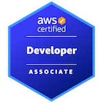

  
  

### Hi there 👋

I am a seasoned software engineer with a passion for coding that has spanned over two decades. Starting with Pascal, C/C++, I quickly transitioned to PHP and JavaScript, establishing a strong foundation in web development.

I have used all major front-end frameworks, with React becoming my framework of choice. I have also used languages like Golang, Elixir, and Python, Ruby and their respective frameworks.

Over the course of the past ten years I have worked on frontend, backend, and full-stack projects, as well as mobile applications. I have also worked on a number of DevOps projects, including CI/CD pipelines, infrastructure as code, and container orchestration.

With over a decade of professional experience under my belt, I consistently deliver high-quality solutions to complex problems. Proficient in DevOps practices, I leverage tools like Kubernetes and Terraform to orchestrate deployments in leading cloud platforms such as AWS and DigitalOcean.

<!--
**v0rs4/v0rs4** is a ✨ _special_ ✨ repository because its `README.md` (this file) appears on your GitHub profile.

Here are some ideas to get you started:

- 🔭 I’m currently working on ...
- 🌱 I’m currently learning ...
- 👯 I’m looking to collaborate on ...
- 🤔 I’m looking for help with ...
- 💬 Ask me about ...
- 📫 How to reach me: ...
- 😄 Pronouns: ...
- ⚡ Fun fact: ...
-->
